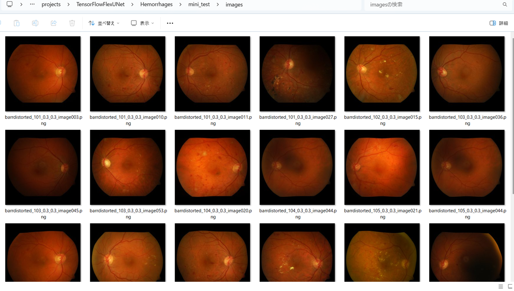

<h2>TensorFlow-FlexUNet-Image-Segmentation-Diabetic-Retinopathy-Hemorrhages (2025/09/30)</h2>
Toshiyuki Arai 
Software Laboratory antillia.com  
This is the first experiment of Image Segmentation for <b>Diabetic Retinopathy Hemorrhage Lesions</b>, based on 
our <a href="./src/TensorFlowFlexUNet.py">TensorFlowFlexUNet</a>
 (<b>TensorFlow Flexible UNet Image Segmentation Model for Multiclass</b>)
 and a 512x512 pixels 
<a href="https://drive.google.com/file/d/1-DaxT-7R9SiXVBQMKl9ouBctgNJcu4ey/view?usp=sharing">Augmented-Hemorrhages-PNG-ImageMask-Dataset.zip</a>
, which was derived by us from 
<a href="http://www.it.lut.fi/project/imageret">diaretdb1_v_1_1 (http://www.it.lut.fi/project/imageret)
</a>
<!--
 
 
 On singleclass Hemorrhages model, please refer to our repository
<a href="https://github.com/sarah-antillia/Tensorflow-Image-Segmentation-Pre-Augmented-Hemorrhages">
Tensorflow-Image-Segmentation-Pre-Augmented-Hemorrhages</a>
 -->
 
 
As demonstrated in <a href="https://github.com/sarah-antillia/TensorFlow-FlexUNet-Image-Segmentation-STARE-Retinal-Vessel">
TensorFlow-FlexUNet-Image-Segmentation-STARE-Retinal-Vessel</a>,
 our Multiclass TensorFlowFlexUNet, which uses categorized masks, can also be applied to 
single-class image segmentation models. 
This is because it inherently treats the background as one category and your single-class mask data as 
a second category. In essence, your single-class segmentation model will operate with two categorized classes within our Multiclass UNet framework.
  

<b>Actual Image Segmentation for Images of 512x512 pixels</b> 
As shown below, the inferred masks predicted by our segmentation model trained on the 
our dataset appear similar to the ground truth masks. 
 
<table>
<tr>
<th>Input: image</th>
<th>Mask (ground_truth)</th>
<th>Prediction: inferred_mask</th>
</tr>
<tr>
<td></td>
<td></td>
<td></td>
</tr>

<tr>
<td></td>
<td></td>
<td></td>
</tr>

<tr>
<td></td>
<td></td>
<td></td>
</tr>
</table>

 

<h3>1. Dataset Citation</h3>
The dataset used here was obtained from the following 
<a href="http://www.it.lut.fi/project/imageret">diaretdb1_v_1_1 (http://www.it.lut.fi/project/imageret)
</a>
  
The database consists of 89 colour fundus images of which 84 contain at least mild non-proliferative 
 signs (Microaneurysms) of the diabetic retinopathy, and 5 are considered as normal which do not contain 
  any signs of the diabetic retinopathy according to all experts who participated in the evaluation.  
  Images were captured using the same 50 degree field-of-view digital fundus camera with varying imaging settings. 
   The data correspond to a good (not necessarily typical) practical situation, where the images are comparable,  
   and can be used to evaluate the general performance of diagnostic methods.  
   This data set is referred to as "calibration level 1 fundus images".
  

<b>Licence</b> 
Unknown
 
 
<h3>
<a id="2">
2 Hemorrhages ImageMask Dataset
</a>
</h3>
<h4>2.1 Download Hemorrhages-PNG-ImageMask-Dataset</h4>
 If you would like to train this Hemorrhages Segmentation model by yourself,
 please download  our dataset <a href="https://drive.google.com/file/d/1-DaxT-7R9SiXVBQMKl9ouBctgNJcu4ey/view?usp=sharing">
 Augmented-Hemorrhages-PNG-ImageMask-Dataset.zip  </a> on the google drive
, expand the downloaded and put it under <b>./dataset</b> folder to be. 
<pre>
./dataset
└─Hemorrhages
    ├─test
    │   ├─images
    │   └─masks
    ├─train
    │   ├─images
    │   └─masks
    └─valid
        ├─images
        └─masks
</pre>
 
<b>Hemorrhages Statistics</b> 
 
 
As shown above, the number of images of train and valid datasets is not large  to use for a training set of our segmentation model.
 
 
  
To generate the pre-augmented dataset, we used an offline augmentation tool 
<a href="./generator/ImageMaskDatasetGenerator.py">ImageMaskDatasetGenerator.py</a> and
and a dataset <a href="./generator/split_master.py">splitter.py.</a> 
 
On the derivation of this dataset, please see also our experiment
<a href="https://github.com/sarah-antillia/Tensorflow-Image-Segmentation-Pre-Augmented-Hemorrhages">
Tensorflow-Image-Segmentation-Pre-Augmented-Hemorrhages</a>
  
 
<b>Train_images_sample</b> 

 
<b>Train_masks_sample</b> 

 

<h3>
3 Train TensorFlowUNet Model
</h3>
 We trained Hemorrhages TensorFlowFlexUNet Model by using the following
<a href="./projects/TensorFlowFlexUNet/Hemorrhages/train_eval_infer.config"> <b>train_eval_infer.config</b></a> file.  
Please move to ./projects/TensorFlowFlexUNet/Hemorrhagesand run the following bat file. 
<pre>
>1.train.bat
</pre>
, which simply runs the following command. 
<pre>
>python ../../../src/TensorFlowFlexUNetTrainer.py ./train_eval_infer.config
</pre>

<b>Model parameters</b> 
Defined a small base_filters=16 and large base_kernels=(9,9) for the first Conv Layer of Encoder Block of 
<a href="./src/TensorFlowFlexUNet.py">TensorFlowFlexUNet.py</a> 
and a large num_layers (including a bridge between Encoder and Decoder Blocks).
<pre>
[model]
image_width    = 512
image_height   = 512
image_channels = 3

num_classes    = 2

base_filters   = 16
base_kernels   = (9,9)
num_layers     = 8
dropout_rate   = 0.04
dilation       = (1,1)

</pre>

<b>Learning rate</b> 
Defined a small learning rate.  
<pre>
[model]
learning_rate  = 0.00007
</pre>

<b>Online augmentation</b> 
Disabled our online augmentation.  
<pre>
[model]
model         = "TensorFlowFlexUNet"
generator     = False
</pre>

<b>Loss and metrics functions</b> 
Specified "categorical_crossentropy" and <a href="./src/dice_coef_multiclass.py">"dice_coef_multiclass"</a>. 
<pre>
[model]
loss           = "categorical_crossentropy"
metrics        = ["dice_coef_multiclass"]
</pre>
<b>Learning rate reducer callback</b> 
Enabled learning_rate_reducer callback, and a small reducer_patience.
<pre> 
[train]
learning_rate_reducer = True
reducer_factor     = 0.4
reducer_patience   = 4
</pre>

<b>Early stopping callback</b> 
Enabled early stopping callback with patience parameter.
<pre>
[train]
patience      = 10
</pre>

<b>RGB Color map</b> 
rgb color map dict for Hemorrhages 1+1 classes.
<pre>
[mask]
mask_datatype    = "categorized"
mask_file_format = ".png"

;Hemorrhages rgb color map dict for 2 classes.
;   Background:black, Hemorrhages: red
rgb_map = {(0,0,0):0,(255,0,0):1}

</pre>

<b>Epoch change inference callback</b> 
Enabled <a href="./src/EpochChangeInferencer.py">epoch_change_infer callback (EpochChangeInferencer.py)</a></b>. 
<pre>
[train]
epoch_change_infer       = True
epoch_change_infer_dir   =  "./epoch_change_infer"
num_infer_images         = 6
</pre>

By using this callback, on every epoch_change, the inference procedure can be called
 for 6 images in <b>mini_test</b> folder. This will help you confirm how the predicted mask changes 
 at each epoch during your training process.    

<b>Epoch_change_inference output at starting (epoch 1,2,3)</b> 
 
 
<b>Epoch_change_inference output at middlepoint (epoch 22,23 24)</b> 
 
 

<b>Epoch_change_inference output at ending (epoch 46,47,48)</b> 
 
 

In this experiment, the training process was terminated at epoch 48.  
 
 

<a href="./projects/TensorFlowFlexUNet/Hemorrhages/eval/train_metrics.csv">train_metrics.csv</a> 
 

 
<a href="./projects/TensorFlowFlexUNet/Hemorrhages/eval/train_losses.csv">train_losses.csv</a> 
 

 

<h3>
4 Evaluation
</h3>
Please move to a <b>./projects/TensorFlowFlexUNet/Hemorrhages</b> folder, 
and run the following bat file to evaluate TensorFlowUNet model for Hemorrhages. 
<pre>
./2.evaluate.bat
</pre>
This bat file simply runs the following command.
<pre>
python ../../../src/TensorFlowFlexUNetEvaluator.py ./train_eval_infer.config
</pre>

Evaluation console output: 

  Image-Segmentation-Hemorrhages

<a href="./projects/TensorFlowFlexUNet/Hemorrhages/evaluation.csv">evaluation.csv</a> 

The loss (categorical_crossentropy) to this Hemorrhages/test was very low, and dice_coef_multiclass very high as shown below.
 
<pre>
categorical_crossentropy,0.0064
dice_coef_multiclass,0.9974
</pre>
 
<h3>
5 Inference
</h3>
Please move to a <b>./projects/TensorFlowFlexUNet/Hemorrhages</b> folder 
,and run the following bat file to infer segmentation regions for images by the Trained-TensorFlowUNet model for Hemorrhages. 
<pre>
./3.infer.bat
</pre>
This simply runs the following command.
<pre>
python ../../../src/TensorFlowFlexUNetInferencer.py ./train_eval_infer.config
</pre>

<b>mini_test_images</b> 
 
<b>mini_test_mask(ground_truth)</b> 
 

<b>Inferred test masks</b> 
 
 

<b>Enlarged images and masks </b> 

<table>
<tr>
<th>Image</th>
<th>Mask (ground_truth)</th>
<th>Inferred-mask</th>
</tr>

<tr>
<td></td>
<td></td>
<td></td>
</tr>

<tr>
<td></td>
<td></td>
<td></td>
</tr>

<tr>
<td></td>
<td></td>
<td></td>
</tr>
<tr>
<td></td>
<td></td>
<td></td>
</tr>
<tr>
<td></td>
<td></td>
<td></td>
</tr>
<tr>
<td></td>
<td></td>
<td></td>
</tr>

</table>

 

<h3>
References
</h3>
<b>1.The diaretdb1 diabetic retinopathy database and evaluation protocol </b> 
T. Kauppi, V. Kalesnykiene, J.-K. Kamarainen, L. Lensu, I. Sorri, A. Raninen, et al. 
<a href="https://webpages.tuni.fi/vision/public_data/publications/bmvc2007_diaretdb1.pdf">
https://webpages.tuni.fi/vision/public_data/publications/bmvc2007_diaretdb1.pdf</a>

 
 
<b>2.Hard Exudates Segmentation in Diabetic Retinopathy Using DiaRetDB1</b> 
Ma Yinghua, Yang Heng, R. Amarnath, Zeng Hui 
<a href="https://ieeexplore.ieee.org/document/10669034">https://ieeexplore.ieee.org/document/10669034</a>
 
 
<b>3. Detection of Early Signs of Diabetic Retinopathy Based on Textural  
and Morphological Information in Fundus Images</b> 
Adrián Colomer, Jorge Igual, Valery Naranjo  
<a href="https://pmc.ncbi.nlm.nih.gov/articles/PMC7071097/">
https://pmc.ncbi.nlm.nih.gov/articles/PMC7071097/
</a>
 
 
<b>4.Evaluation of fractal dimension effectiveness for damage detection in retinal background</b> 
Adrián Colomer, Valery Naranjo, Thomas Janvier, Jose M. Mossi 
<a href="https://www.sciencedirect.com/science/article/pii/S0377042718300268">
https://www.sciencedirect.com/science/article/pii/S0377042718300268</a>
 
 

<b>5.Tensorflow-Image-Segmentation-Pre-Augmented-Hemorrhages </b> 
Toshiyuki Arai antillia.com 
<a href="https://github.com/sarah-antillia/Tensorflow-Image-Segmentation-Pre-Augmented-Hemorrhages">
https://github.com/sarah-antillia/Tensorflow-Image-Segmentation-Pre-Augmented-Hemorrhages
</a>

